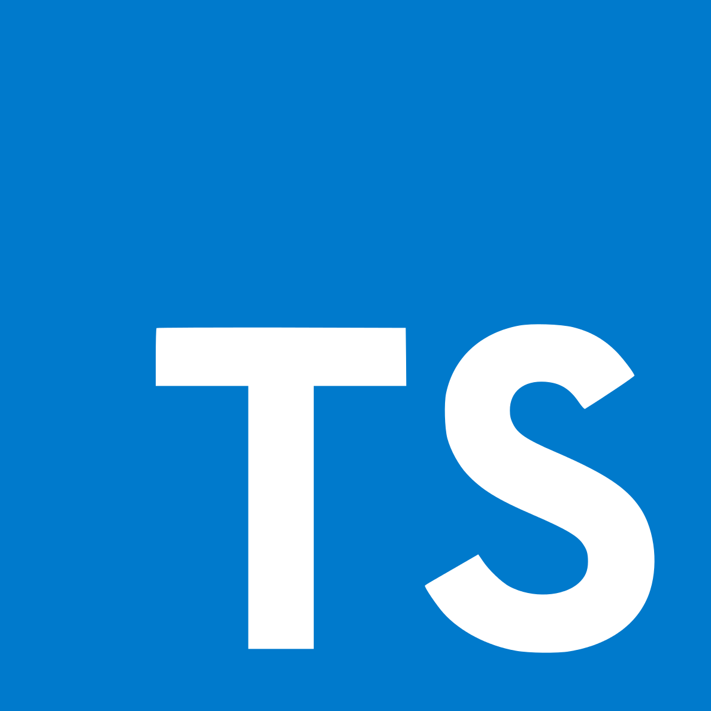
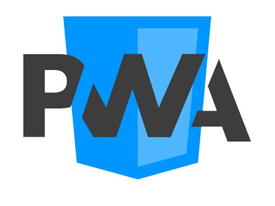
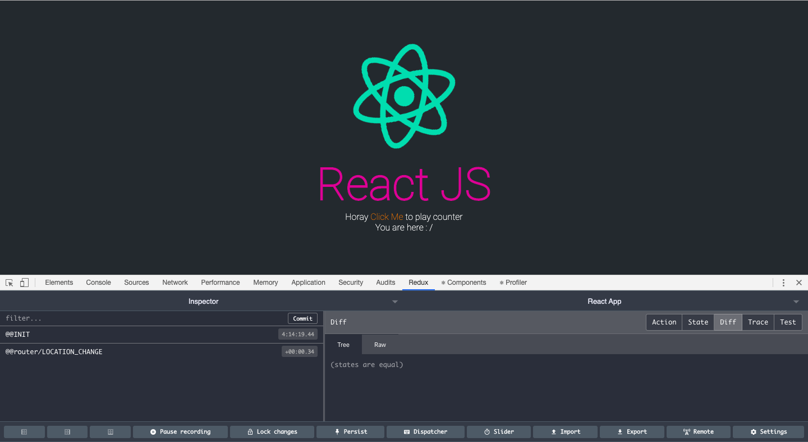
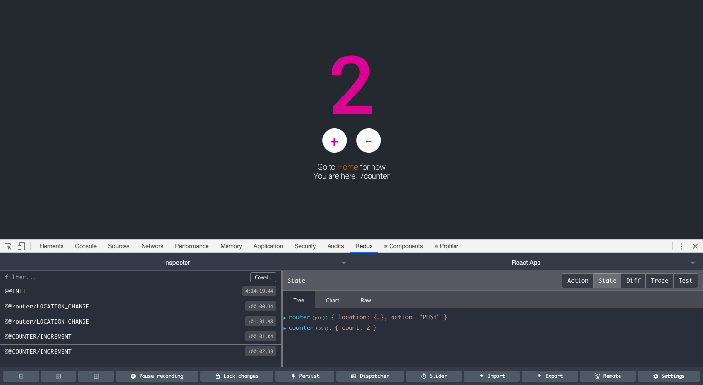

# ts-frontend-boilerplate

<div align="left">
  <!-- Dependency Status -->
  <a href="https://david-dm.org/bonkzero404/ts-frontend-boilerplate">
    
  </a>
  <!-- devDependency Status -->
  <a href="https://david-dm.org/bonkzero404/ts-frontend-boilerplate#info=devDependencies">
    
  </a>
  <!-- Build Status -->
  <a href="https://travis-ci.org/bonkzero404/ts-frontend-boilerplate">
    
  </a>
  <!-- Coveral -->
  <a href='https://coveralls.io/github/bonkzero404/ts-frontend-boilerplate?branch=master'>
    
  </a>

</a>

<p>This framework has support for building applications with electron, it's very simple and powerful for building modern web app or desktop app</p>

<p>
  React Boilerplate uses <a href="https://www.typescriptlang.org/">Typescript</a>, <a href="https://facebook.github.io/react/">React</a>, <a href="https://github.com/reactjs/redux">Redux</a>, <a href="https://github.com/reactjs/react-router">React Router</a>, <a href="https://eslint.org/">Eslint</a>, <a href="https://developers.google.com/web/progressive-web-apps">PWAs</a>, <a href="http://webpack.github.io/docs/">Webpack</a> and <a href="https://github.com/gaearon/react-hot-loader">React Hot Loader</a> for rapid application development (HMR).
</p>

<br>

<div align="center" style="margin-bottom: 20px">
  <a href="https://facebook.github.io/react/"></a>
  <a href="https://webpack.github.io/"></a>
  <a href="http://redux.js.org/"></a>
  <a href="https://github.com/ReactTraining/react-router"></a>
  <a href="https://eslint.org/"></a>
  <a href="https://www.typescriptlang.org/"></a>
  <a href="https://developers.google.com/web/progressive-web-apps"></a>
  <a href="https://jestjs.io"></a>
  <a href="https://www.docker.com"></a>
</div>

<h1>Installation</h1>
<h2>Clone the repository</h2>

```bash
$ git clone https://github.com/bonkzero404/ts-frontend-boilerplate.git
$ cd ts-frontend-boilerplate
```

<h2>Install Dependencies</h2>

```bash
## Using yarn
$ yarn

## Using npm
$ npm install
```
<h1>Running the Browser Examples with Development Mode</h1>

```bash
$ yarn watch
```
<p>Now you can browse to <a href="http://localhost:11211/">http://localhost:11211/</a></p>


If you want to play counter


<h2>Unit Test</h2>
<p>Component Test defined & Snapshoot components</p>

```bash
$ yarn test
```

<h1>Running With Electron for Development Mode</h1>
<h2>Set Environment Variable</h2>
<p>open the .env file and change the <strong>ELECTRON</strong> variable to true</p>

```bash
## Require for configure build webpack
SOURCE_DEV = src
PUBLIC_DEV = public
BUILD_DEST = dist

## Require for configure webpack copy ignore in assets
ASSETS_COPY_IGNORE = ""

## Dev server configure
DEV_HOST = http://localhost
DEV_PORT = 11211

## Sites configure
TITLE = "Typescript React Framework"

## Add exposed global var in here
ELECTRON = true ## <-- Change this if you want to use electron

```

<h2>Running Example Electron App</h2>

```bash
## first
$ yarn watch
## or 
$ npm run watch

## last
## then running the electron app with the following command:
$ yarn start:elc:dev
## or
$ npm run start:elc:dev
```

<h1>Build Script to Production and Running the Example App</h1>
<h2>Web App</h2>

```bash
## build the script
$ yarn build

## running for test production
$ yarn start:web:prod
```

Browse to <a href="http://localhost:5000">http://localhost:5000</a>


<h2>Electron App</h2>

```bash
## build the script
$ yarn build

## running for test production
$ yarn start:elc:prod
```

<h2>Build and Running with Docker</h2>

```bash
$ docker build -t ts-frontend-boilerplate .
$ docker run -p 11000:5000 -d ts-frontend-boilerplate
```
Browse to <a href="http://localhost:5000">http://localhost:11000</a>
